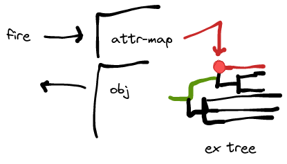

# Bridging `Expr` and `Ex` - how to implement `IntEx` object, for instance

The main issue is event dispatch. In current behaviour, we assume a transitory in-memory view only,
where `"key".attr` upon expansion just registers an observer via `react` which will be disposed when the
`Control`/`Act`/`Widget` view closes or runner is disposed. Since now there is no real disposal of the
`IntObj` that wraps an `Ex[Int]`, we can not rely on this behaviour. If we call `react` on each deserialisation,
we end up with a multiplication of event paths, and will invoke them on changes even if there is no leaf
observer.

If we were to avoid that, we would need to restrict the `Ex[A]` to `IExpr[T, A]` expansion to happen only temporarily
during the `pullUpdate`. Then we would need to know the source events that must be connected, and that connection
happens only during instantiation, but not deserialisation. This draws into doubt the usefulness of relying on
`"key".attr`? Because that might be the result of a `map` or `flatMap` over other things and not "stable". It's 
somehow similar to creating `Proc.Output` instances depending on the graph elements. We might also want to use a
shallow search on the `Ex`; are they collected anywhere? I believe not (only `addControl`). All we could do is
"test" the expression by expanding it once and collecting information. Then perhaps a better idea is to introduce
new abstractions for inlets and outlets of an ex-object?

## Use cases

One use case would be to generate predicates for filtering or sorting contents, say of a folder. Here, this could
be thought of as in-memory only, not persisted. Another case is arithmetic expressions based on other primitive
values, e.g. keeping an `ampDb` version of a global variable. These must be persisted.

A basic question to answer is whether the inputs of the expression program should be variable or not. It could be
useful to be able to swap them out. But should their types be rigid? E.g. "always a tuple 2 expression program with
one integer and one boolean input". The `"key".attr[A](default)` syntax is also not ultimately satisfying. An
advantage, however, is that we can be more relaxed with matching the input types (e.g. converting automatically
between different numeric types). A disadvantage is having to deal with absent inputs. We could introduce a shortcut,
like `In(0)` as shorthand for `"in".attr[Int](0)`.

We'll still run into the problem - that was never addressed - of disposing objects. Say the expression program
lives inside an `IntObj.newVar`; then when the editor contents is "committed", how do we dispose the old program
to avoid that `Targets` of inputs get more and more populated with stale dependents? We cannot know that we can
safely dispose the previous version, as it might be stilled referenced in the workspace. It all boils down to the
need to implement proper garbage collection :-/

For the time being, we could just call `dispose` on the old object and put the restriction on the user to not keep
using the old version. That's not nice, but at least it would prevent the bigger problem of fastly growing targets
children lists as one develops an expression program.

----

## Approaches

Like `Pattern` and `Stream`, one could think of a serialised version of the ex programme; but the serialization
layer is made for `Ex` not `IExpr`, and the current implementations of `IExpr` would both need serialization and
storing all their inputs in handles instead of directly. Seems like an extreme amount of work to change that.

Despite the extra effort of re-expanding and disposing the ex programme upon each event pull phase, the simplest
solution for now could be to scan the ex programme for known objects such as `Attr.apply` or `Attr.WithDefault`,
see if they have constant keys, then set up the event links for those. There is already a mechanism that makes
sure we traverse the entire tree: Serialization. We just need to add a custom `RefMapOut` and match the written
expressions.

Actually, `Attr.WithDefault` already uses a constant key.

----

## An example: predicate on size of a folder

Things like the following should work: an object carrying an `Ex[Boolean]` that indicates whether a folder is
empty or not. The program would probably be `In(Folder()).nonEmpty` or `"in".attr(Folder()).nonEmpty`.

A difficulty is introduced into the very reduced `Event` model by the fact that we cannot "directly" watch for
changes of the attribute with key `"in"`; instead, there must be one default event listening for any attribute map
change; this way `Added`, `Removed`, `Replaced` can be detected and filtered. But it cannot be detected whether an
existing attribute changes, e.g. a `Folder` stored in the `"in"` attribute. The ex obj would have to add another
event connection when that folder exists; consequently, remove it when the folder disappears from the attribute
entry. Is it safe to call `--->` and `-/->` during an event dispatch? Since would happen in `pullUpdate`, all
event reactions have been collected by now, so it _should_ be safe. But it introduces the need to cache the observed
values; at least store a boolean that indicates "watching / not-watching" (as we can always find the event via
`upd.before.changed`)? Even more complicated will be a support of indirect keys, such as `"main:sub"`. In the first
implementation, we could forbid those keys and/or print a warning that they are not properly tracked.

## An example: mapping over a collection

An object carrying an `Ex[Long]` that indicates the maximum length of a list of audio cues.
The program could be `In(Folder()).children.collect[AudioCue].map(_.spec.numFrames).maxOption.getOrElse(0L)`.
Now even tracing the `changed` of the `"in"` attribute's value would not suffice; it would only detect additions and
removals of the folder, but not changes to an `AudioCue.Obj.Var` contained in it.
Essentially, such as scenario can only work if we go the route of persisting the entire expanded `IExpr` tree.
There are currently around 60 implementations of `IExpr` in Lucre alone, more in SP.

The implementation of the Pattern library's `Stream` might be a way to go this direction. To explore it, one would
probably create a branch with the `Ex` basics, plus unary and binary operations, plus attributes handling, and see
if this works or not.

----

# Work from 'ExObjTest' repository

The `Attr` graph element must either use the regular `Observer` when used in-memory (as part of a `Control`, for
example); or it must use an `Event` if persisted as part of an ex-obj. Such an event must write and (de)serialise
a `Node`, which could be either the encompassing ex-obj, or the expanded attribute. The big disadvantage of the
former is that it could mean a large blob must be deserialised every time, and it will occupy space as multiple
attributes are used; also there must be a way to identify the `Attr`, i.e. one must map between event slots and
expanded attribute. In the latter case, the `Node` would probably just be expanded attribute. What remains unclear
is how the `ITargets` are stored or not stored and recreated.



In this illustration, we assume an entry in the `AttrMap` is mapped; the regular `Event` chain is in black,
the red spot is the ex program's `Attr element; it would deserialise its dependents - red line; but it would also
need to ensure that its `ITargets` are deserialised and invoked, along the green line. Since
event filtering only happens in the pull phase, the push will automatically go through to the
ex obj's outlet, and then (black left pointing line) either to other expressions or to a live
observer in the UI.

---

Looking at this, I don't think it makes a lot of sense to introduce serialisation for `IExpr`; in any case we
would have to unwrap the whole thing. Let's restate the findings:

- it's possible to use an ad-hoc "headless" context to "run" the expression
- each `Event#react` should be captured for the ex obj to collect the events to listen to
- there is probably little benefit in making a complicated structure to propagate the event
- it is probably the best to simply evaluate the ex obj when an input `Event` fires
- in order to produce a `Change` update, we might need to cache the previous expression value
- but we might get around having to declare `Caching`, by just caching the last call to `value`?
  Because any sink connected would poll `value` initially before listening to events?
- as an optimisation, we could keep the new explicit `connect` methods on the `IExpr`s, and skip calling  
  them using a flag on the context. This would avoid a lot of setup when essentially the `IEvent` queue
  is never used

---

## Calls

- `Obj.Attr` -> `ExpandedObjAttr` -> `obj.changed.--->...` -- NOT; this is an `IExpr[T, graph.Obj]`
- `Obs.Bridge.cellView` -> e.g. `ObjCellViewVarImpl` -- OK
- `Attr` if `selfOption.isDefined` -> `StmObjAttrMapCellView` -- OK
- `Attr` if `isNested` -> `StmObjCtxCellView` (`AbstractCtxCellView`) -- irrelevant
- `Obj.Bridge.contextCellView` -> `AbstractCtxCellView` -- irrelevant
- `CellViewImpl.AttrImpl`

These are the main types involved in the entire API; e.g. the graph element `Folder` uses
`ObjCellViewVarImpl` and `AbstractCtxCellView`. It's expanded class uses a `setObj` call that
uses `lObj.changed.react` to install the listeners.

Note that `AbstractCtxCellView` purely operates on `Context.Attr`, and not on an object's
`AttrMap`; therefore it can be removed from the equation (it does not need changes). Therefore,
it also applies to its subclasses like `StmObjCtxCellView`.

## Dynamic

The problematic bit is updating the objects that are observed. Say `"in".attr(0)`, and say that entry already
exists. Now we would gather in the test expansion the event listeners for the attribute map as well as for
the particular `IntObj` found in the attribute map's entry. Now the object is replaced, eventually resulting
in a `pullUpdate` of the wrapping ex obj. This would cause in some form of caching `IExpr` a kind of
`setObj` method to be called, disposing the old listener and installing a new listener (see previous section
for the example of `Folder`).

Basically the ex obj has a list of events it listens to, and the call to `value` or `pullUpdate` produces a new
such list;  this list may be different from the old list; in that case, we would have to unregister
`oldList diff newList`, and newly register `newList diff oldList`.

----

# Notes 28-Dec-2021

Here is the current run:

```
--> begin new
REGISTER EVENT de.sciss.lucre.impl.TMapImpl$Impl$changed$@44ad6a12 (new? true)
REMOVE  EVENTS Vector()
ADD     EVENTS Vector(de.sciss.lucre.impl.TMapImpl$Impl$changed$@44ad6a12)
<-- end   new
--- put 'in'
--- add react
--- update 'in'
--- call 'value'
REGISTER EVENT de.sciss.lucre.impl.TMapImpl$Impl$changed$@44ad6a12 (new? true)
REGISTER EVENT de.sciss.lucre.impl.ExprVarImpl$changed$@8bff60f4 (new? true)
REMOVE  EVENTS Vector()
ADD     EVENTS Vector(de.sciss.lucre.impl.ExprVarImpl$changed$@8bff60f4)
OUTPUT now 2000
```

The problem here is that upon creation, the attribute map entry `"in"` has not been added yet,
so there is only one event that we listen to. The "put 'in'" action appears before the `IntEx` has been
connected, so (I think) that's why no event is observed (the event push does not yield any live reaction).
The call to "add react" does not change anything. There are two possible solutions:

- add `Caching`, so the `IntEx` always gets notified
- or check the first reaction added via `react`, and internally update `value`. This might be tricky, as
  there could be another `Event` in between, and then there is no way of knowing when `IntEx` is "hot".

__Solution:__ We work with `Caching` now, and it seems to work as expected.
